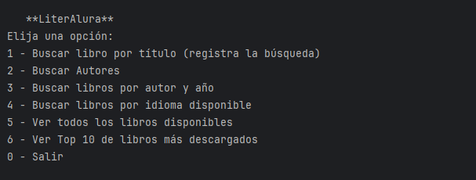
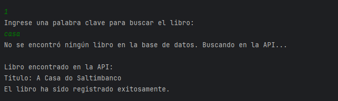
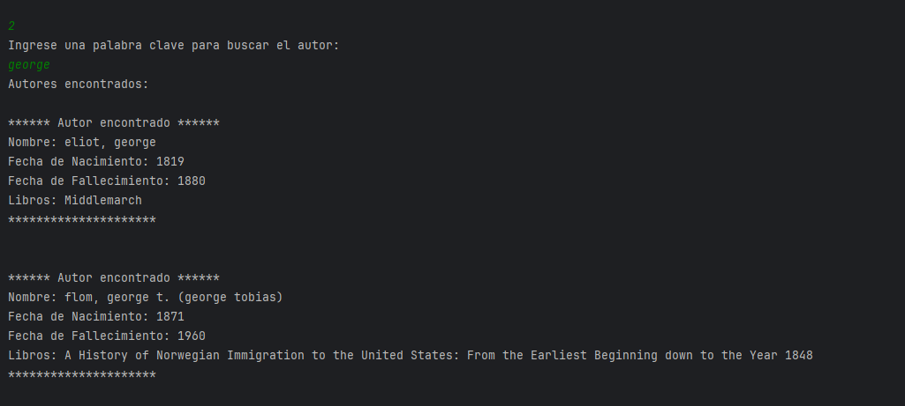
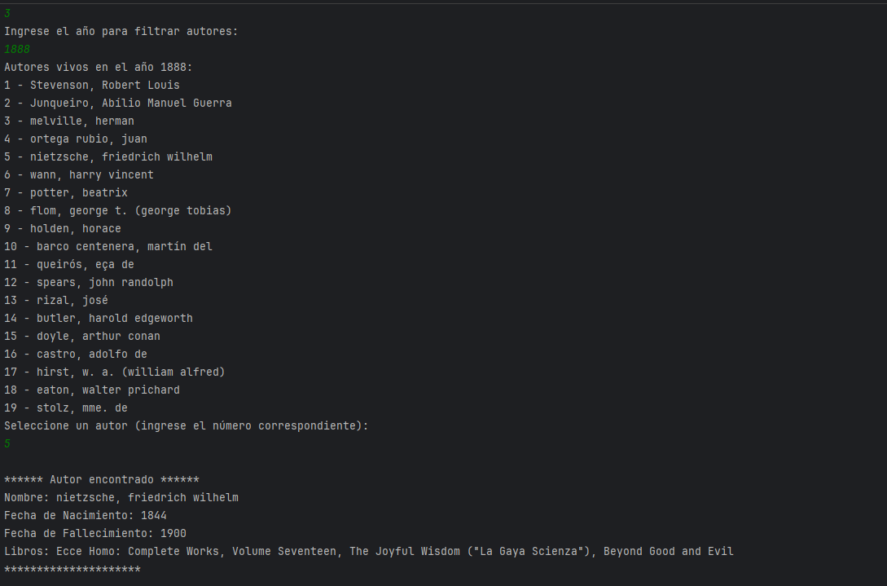
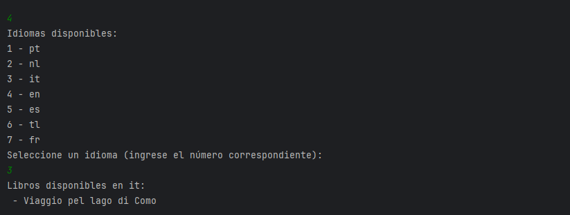
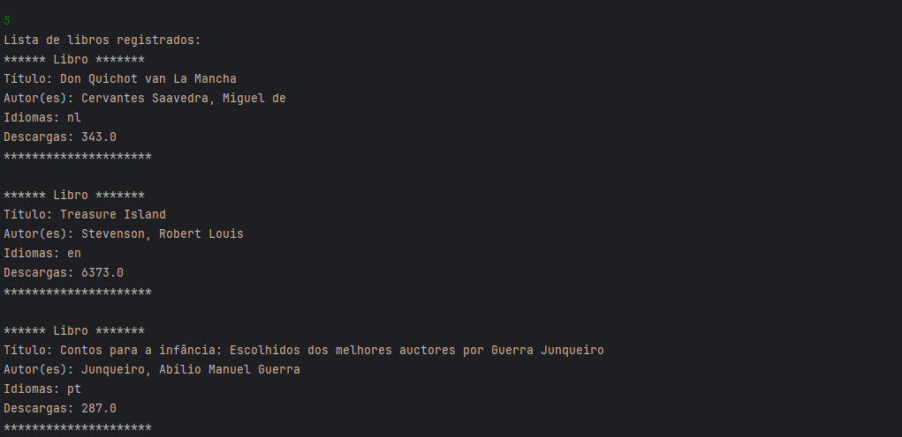
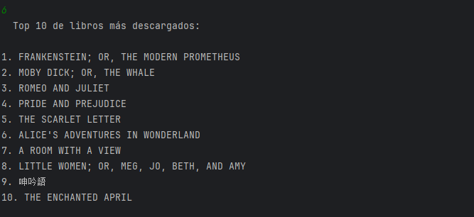

---

# **LiterAlura - Sistema de Gestión de Libros y Autores**

Bienvenido a **LiterAlura**, una aplicación diseñada para gestionar libros, autores y datos bibliográficos interactuando con una base de datos y la API externa [Gutendex](https://gutendex.com). Esta aplicación ofrece funcionalidad avanzada de búsqueda, almacenamiento y visualización de información literaria.

---

## **Estructura del Proyecto**

```plaintext
com.aluracurso.challenger.literAlura
│
├── LiterAluraApplication.java # Clase de ejecución de la aplicación (ubicada en el raíz)
│
├── principal/
│   └── Principal.java         # Controlador principal de la aplicación
│
├── model/
│   ├── Autor.java             # Modelo de autor con datos biográficos
│   ├── Libro.java             # Modelo de libro, idiomas y descargas
│   ├── Datos.java             # Contenedor de datos de resultados API
│   ├── DatosLibros.java       # Representación de libros desde la API
│   ├── DatosAutor.java        # Representación de autores desde la API
│   └── Bibliografia.java      # Relación entre autores y libros
│
├── repository/
│   ├── AutorRepository.java   # Repositorio para manejar operaciones sobre autores
│   └── LibroRepository.java   # Repositorio para manejar operaciones sobre libros
│
├── service/
│   ├── ConsumoAPI.java        # Interacción con la API externa
│   ├── ConvierteDatos.java    # Implementación de conversión de datos
│   └── IConvierteDatos.java   # Interfaz para conversión de datos JSON
```

---

## **Cómo Ejecutar**

1. Configura la conexión a la base de datos en el archivo `application.properties` de Spring Boot.
2. Compila y ejecuta la aplicación mediante `LiterAluraApplication`.
3. Utiliza el menú interactivo para realizar operaciones de búsqueda y gestión de libros y autores.

---

## **Flujo de Ejecución del Menú**

La interacción con el usuario ocurre mediante el **menú de consola** definido en la clase `Principal`. Este menú llama a distintos métodos para manejar búsquedas, mostrar datos y registrar información en la base de datos.



### **1. Buscar libro por título**
#### Flujo:
1. **Entrada del usuario:** El usuario ingresa una palabra clave para buscar un libro.
2. **Base de datos:**
   - Llama a `LibroRepository.findLibrosCandidatosPorTitulo`.
   - Filtra los resultados mediante `contienePalabraCompleta`.
   - Si se encuentran libros, se muestran con `mostrarInformacionLibro`.
3. **API externa:**
   - Si no se encuentran libros, consulta la API externa mediante `ConsumoAPI.obtenerDatos`.
   - Llama a `registrarLibroDesdeAPI` para almacenar el libro y sus autores en la base de datos.

#### Clases involucradas:
- **`Principal`**: Controlador principal.
- **`LibroRepository`**: Busca libros en la base de datos.
- **`ConsumoAPI`**: Interactúa con la API externa.
- **`ConvierteDatos`**: Convierte los datos JSON de la API a objetos Java.



---

### **2. Buscar autores**
#### Flujo:
1. **Entrada del usuario:** El usuario ingresa una palabra clave para buscar autores.
2. **Base de datos:**
   - Llama a `AutorRepository.findByNombreCandidato`.
   - Valida coincidencias exactas de palabras con `contienePalabraCompletaEnNombre`.
   - Muestra los resultados con `mostrarDatosAutor`.

#### Clases involucradas:
- **`Principal`**: Controlador principal.
- **`AutorRepository`**: Busca autores en la base de datos.


---

### **3. Buscar libros por autor y año**
#### Flujo:
1. **Entrada del usuario:** El usuario ingresa un año.
2. **Base de datos:**
   - Llama a `AutorRepository.findAutoresVivosEnAno`.
   - Muestra una lista de autores vivos en ese año.
   - El usuario selecciona un autor para mostrar sus libros con `mostrarDatosAutor`.

#### Clases involucradas:
- **`Principal`**: Controlador principal.
- **`AutorRepository`**: Busca autores vivos en un año específico.
- **`Bibliografia`**: Relaciona autores con libros.
- **`Libro` y `Autor`**: Muestran los datos relacionados.


---

### **4. Buscar libros por idioma disponible**
#### Flujo:
1. **Base de datos:**
   - Llama a `LibroRepository.findDistinctIdiomas` para obtener la lista de idiomas únicos disponibles.
   - El usuario selecciona un idioma.
   - Llama a `LibroRepository.findLibrosPorIdioma` para encontrar libros escritos en el idioma seleccionado.
2. **Presentación:**
   - Muestra los libros encontrados en el idioma seleccionado.

#### Clases involucradas:
- **`Principal`**: Controlador principal.
- **`LibroRepository`**: Gestiona consultas relacionadas con idiomas y libros.


---

### **5. Ver todos los libros disponibles**
#### Flujo:
1. **Base de datos:**
   - Llama a `LibroRepository.findAll` para obtener todos los libros registrados.
2. **Presentación:**
   - Muestra la información de cada libro usando `mostrarInformacionLibro`.

#### Clases involucradas:
- **`Principal`**: Controlador principal.
- **`LibroRepository`**: Recupera todos los libros almacenados en la base de datos.


---

### **6. Ver Top 10 de libros más descargados**
#### Flujo:
1. **API externa:**
   - Consulta la API `Gutendex` mediante `ConsumoAPI.obtenerDatos`.
   - Los datos se convierten en objetos Java con `ConvierteDatos.obtenerDatos`.
2. **Orden y filtro:**
   - Los libros se ordenan por `numeroDeDescargas` en orden descendente.
   - Muestra los 10 libros con más descargas.

#### Clases involucradas:
- **`Principal`**: Controlador principal.
- **`ConsumoAPI`**: Interactúa con la API externa.
- **`ConvierteDatos`**: Convierte datos JSON a objetos Java.


---

## **Clases y Su Interacción**

### **`Principal`**
- **Responsabilidad:** Controlar el flujo de la aplicación.
- **Interacciones:**
   - **Con Repositorios:**  
     Accede a `LibroRepository` y `AutorRepository` para buscar, guardar y mostrar datos de libros y autores.
   - **Con Servicios:**  
     Utiliza `ConsumoAPI` y `ConvierteDatos` para obtener y procesar datos de la API externa.

### **`LibroRepository`**
- **Responsabilidad:**  
  Gestionar operaciones relacionadas con la entidad `Libro`.
- **Consultas clave:**
   - `findLibrosCandidatosPorTitulo`: Encuentra libros cuyo título coincida parcialmente con la palabra clave.
   - `findDistinctIdiomas`: Obtiene la lista de idiomas únicos.
   - `findLibrosPorIdioma`: Encuentra libros en un idioma específico.

### **`AutorRepository`**
- **Responsabilidad:**  
  Gestionar operaciones relacionadas con la entidad `Autor`.
- **Consultas clave:**
   - `findByNombreCandidato`: Encuentra autores cuyo nombre coincida parcialmente.
   - `findAutoresVivosEnAno`: Encuentra autores vivos en un año específico.

### **`ConsumoAPI`**
- **Responsabilidad:**  
  Interactuar con la API externa `Gutendex`.
- **Métodos:**
   - `obtenerDatos`: Realiza solicitudes HTTP y devuelve respuestas en formato JSON.

### **`ConvierteDatos`**
- **Responsabilidad:**  
  Convertir datos JSON en objetos Java.
- **Métodos:**
   - `obtenerDatos`: Convierte JSON en una instancia de la clase deseada utilizando Jackson.

### **`Autor`**
- **Atributos:**
   - `nombre`: Nombre completo del autor.
   - `fechaDeNacimiento` y `fechaDeFallecimiento`: Fechas relevantes para el autor.
- **Relaciones:**
   - Con `Bibliografia`: Relación entre autores y sus libros.

### **`Libro`**
- **Atributos:**
   - `titulo`: Título único del libro.
   - `idiomas`: Lista de idiomas en los que está disponible.
   - `numeroDeDescargas`: Número de descargas del libro.
- **Relaciones:**
   - Con `Bibliografia`: Relación entre libros y sus autores.

### **`Bibliografia`**
- **Responsabilidad:**  
  Relacionar las entidades `Libro` y `Autor`.
- **Relaciones:**
   - `libro`: Relación con un libro.
   - `autor`: Relación con un autor.

---

## **Cómo Funciona la Aplicación**

1. **Inicio de la Aplicación:**  
   La clase `LiterAluraApplication` inicia el contexto de Spring Boot y ejecuta el menú mediante `Principal.muestraElMenu`.

2. **Interacción con el Usuario:**  
   El usuario selecciona opciones en el menú, lo que activa métodos específicos en `Principal`.

3. **Acceso a la Base de Datos:**
   - Las operaciones de búsqueda y almacenamiento interactúan con los repositorios JPA (`LibroRepository` y `AutorRepository`).
   - Las relaciones entre autores y libros se manejan mediante la entidad `Bibliografia`.

4. **Consumo de API Externa:**
   - Cuando los datos no están en la base de datos, se consulta la API externa.
   - Los datos de la API se transforman en objetos utilizables y se almacenan en la base de datos.

5. **Presentación de Resultados:**
   - Los resultados de las búsquedas y operaciones se muestran en la consola para el usuario.

---

---


## **Clases y Métodos**

### **`Principal.java`**
Controla la lógica principal del programa, manejando las interacciones con el usuario y la base de datos.

```java
@Service
public class Principal {

   private static final String URL_BASE = "https://gutendex.com/books/";
   private final ConsumoAPI consumoAPI;
   private final ConvierteDatos conversor;
   private final LibroRepository libroRepository;
   private final AutorRepository autorRepository;
   private final Scanner teclado = new Scanner(System.in);

   public Principal(ConsumoAPI consumoAPI, ConvierteDatos conversor, LibroRepository libroRepository, AutorRepository autorRepository) {
      this.consumoAPI = consumoAPI;
      this.conversor = conversor;
      this.libroRepository = libroRepository;
      this.autorRepository = autorRepository;
   }

   public void muestraElMenu() {
      var opcion = -1;
      while (opcion != 0) {
         var menu = """
                  \n   **LiterAlura**
                 Elija una opción:
                 1 - Buscar libro por título (registra la búsqueda)
                 2 - Buscar Autores
                 3 - Buscar libros por autor y año
                 4 - Buscar libros por idioma disponible
                 5 - Ver todos los libros disponibles
                 6 - Ver Top 10 de libros más descargados
                 0 - Salir
                 """;
         System.out.println(menu);

         try {
            if (teclado.hasNextInt()) {
               opcion = teclado.nextInt();
               teclado.nextLine(); // Limpiar el buffer de entrada

               switch (opcion) {
                  case 1 -> buscarLibro();
                  case 2 -> buscarAutoresRegistrados();
                  case 3 -> buscarLibroPorAutorYFecha();
                  case 4 -> buscarLibroPorIdioma();
                  case 5 -> listarLibrosDisponibles();
                  case 6 -> mostrarTopLibros();
                  case 0 -> {
                     System.out.println("Cerrando la aplicación...");
                     teclado.close(); // Cierra el Scanner
                     System.exit(0);  // Finaliza el programa
                  }
                  default -> System.out.println("Opción inválida.");
               }
            } else {
               System.out.println("Entrada no válida, por favor ingresa un número entero.");
               teclado.nextLine(); // Limpiar el buffer
            }
         } catch (Exception e) {
            System.out.println("Error inesperado: " + e.getMessage());
         }
      }
   }

   @Transactional
   private void buscarLibro() {
      System.out.println("Ingrese una palabra clave para buscar el libro:");
      String palabraClave = teclado.nextLine().trim().toLowerCase();

      // Buscar en la base de datos usando LIKE
      List<Libro> candidatos = libroRepository.findLibrosCandidatosPorTitulo(palabraClave);

      // Filtrar por palabra completa
      List<Libro> librosFiltrados = candidatos.stream()
              .filter(libro -> contienePalabraCompleta(libro.getTitulo(), palabraClave))
              .toList();

      if (!librosFiltrados.isEmpty()) {
         System.out.println("Libros encontrados en la base de datos:");
         librosFiltrados.forEach(this::mostrarInformacionLibro);
      } else {
         System.out.println("No se encontró ningún libro en la base de datos. Buscando en la API...");

         // Buscar en la API
         Datos datosBusqueda = obtenerDatosLibros(URL_BASE + "?search=" + palabraClave.replace(" ", "+"));
         Optional<DatosLibros> libroAPI = datosBusqueda.resultados().stream()
                 .filter(libro -> contienePalabraCompleta(libro.titulo().toLowerCase(), palabraClave))
                 .findFirst();

         libroAPI.ifPresentOrElse(datosLibro -> {
            System.out.println("\nLibro encontrado en la API:");
            System.out.println("Título: " + datosLibro.titulo());
            registrarLibroDesdeAPI(datosLibro);
         }, () -> System.out.println("No se encontró ningún libro con esa palabra clave."));
      }
   }

   private void registrarLibroDesdeAPI(DatosLibros datosLibro) {
      Libro nuevoLibro = new Libro(datosLibro);
      List<Autor> autores = datosLibro.autor().stream()
              .map(datosAutor -> autorRepository.findByNombre(datosAutor.nombre().toLowerCase().trim())
                      .orElseGet(() -> {
                         Autor autor = new Autor(datosAutor.nombre().toLowerCase().trim(),
                                 datosAutor.fechaDeNacimiento(),
                                 datosAutor.fechaDeFallecimiento());
                         autorRepository.save(autor);
                         return autor;
                      })).toList();

      nuevoLibro.setAutores(autores);

      if (!libroRepository.existsByTituloIgnoreCase(nuevoLibro.getTitulo())) {
         try {
            libroRepository.save(nuevoLibro);
            System.out.println("El libro ha sido registrado exitosamente.");
         } catch (DataIntegrityViolationException e) {
            System.out.println("Error al intentar registrar el libro: " + nuevoLibro.getTitulo());
         }
      }
   }

   @Transactional
   private void buscarAutoresRegistrados() {
      System.out.println("Ingrese una palabra clave para buscar el autor:");
      String palabraClave = teclado.nextLine().trim().toLowerCase();

      // Buscar en la base de datos con LIKE
      List<Autor> candidatos = autorRepository.findByNombreCandidato(palabraClave);

      // Validar palabras completas dentro del nombre
      List<Autor> autoresFiltrados = candidatos.stream()
              .filter(autor -> contienePalabraCompletaEnNombre(autor.getNombre(), palabraClave))
              .toList();

      if (autoresFiltrados.isEmpty()) {
         System.out.println("No se encontró ningún autor con esa palabra clave.");
      } else {
         System.out.println("Autores encontrados:");
         autoresFiltrados.forEach(this::mostrarDatosAutor);
      }
   }


   private boolean contienePalabraCompleta(String texto, String palabraClave) {
      String[] palabras = texto.split("\\s+");
      for (String palabra : palabras) {
         if (palabra.equalsIgnoreCase(palabraClave)) {
            return true;
         }
      }
      return false;
   }

   private boolean contienePalabraCompletaEnNombre(String nombreCompleto, String palabraClave) {
      // Separar por espacios o comas para cubrir nombres completos como "Melville, Herman"
      String[] palabras = nombreCompleto.split("[\\s,]+");
      for (String palabra : palabras) {
         if (palabra.equalsIgnoreCase(palabraClave)) {
            return true;
         }
      }
      return false;
   }


   private Datos obtenerDatosLibros(String url) {
      var json = consumoAPI.obtenerDatos(url);
      return conversor.obtenerDatos(json, Datos.class);
   }

   private void mostrarInformacionLibro(Libro libro) {
      System.out.println("\n****** Información del Libro ******");
      System.out.println("Título: " + libro.getTitulo());
      System.out.println("Idiomas: " + String.join(", ", libro.getIdiomas()));
      System.out.println("Descargas: " + libro.getNumeroDeDescargas());
      System.out.println("Autor(es): " + libro.getAutores().stream()
              .map(Autor::getNombre)
              .collect(Collectors.joining(", ")));
      System.out.println("***********************************\n");
   }

   private void mostrarDatosAutor(Autor autor) {
      Hibernate.initialize(autor.getBibliografias());
      System.out.println("\n****** Autor encontrado ******");
      System.out.println("Nombre: " + autor.getNombre());
      System.out.println("Fecha de Nacimiento: " + autor.getFechaDeNacimiento());
      System.out.println("Fecha de Fallecimiento: " + autor.getFechaDeFallecimiento());
      System.out.println("Libros: " + autor.getLibros().stream()
              .map(Libro::getTitulo)
              .collect(Collectors.joining(", ")));
      System.out.println("*********************\n");
   }


   private void mostrarTopLibros() {
      var datos = obtenerDatosLibros(URL_BASE);
      System.out.println("  Top 10 de libros más descargados:\n");
      var librosOrdenados = datos.resultados().stream()
              .sorted(Comparator.comparing(DatosLibros::numeroDeDescargas).reversed())
              .limit(10)
              .toList();

      for (int i = 0; i < librosOrdenados.size(); i++) {
         var libro = librosOrdenados.get(i);
         System.out.printf("%d. %s\n", i + 1, libro.titulo().toUpperCase());
      }
   }

   private void listarLibrosDisponibles() {
      var libros = libroRepository.findAll();

      if (libros.isEmpty()) {
         System.out.println("No hay libros registrados en la base de datos.");
         return;
      }

      System.out.println("Lista de libros registrados:");
      libros.forEach(libro -> {
         System.out.println("****** Libro *******");
         System.out.println("Título: " + libro.getTitulo());
         System.out.println("Autor(es): " + libro.getAutores().stream()
                 .map(Autor::getNombre)
                 .collect(Collectors.joining(", ")));
         System.out.println("Idiomas: " + String.join(", ", libro.getIdiomas()));
         System.out.println("Descargas: " + libro.getNumeroDeDescargas());
         System.out.println("*********************\n");
      });
   }

   private void buscarLibroPorIdioma() {
      var idiomasDisponibles = libroRepository.findDistinctIdiomas();

      if (idiomasDisponibles.isEmpty()) {
         System.out.println("No hay libros registrados en la base de datos para obtener idiomas.");
         return;
      }

      while (true) {
         System.out.println("Idiomas disponibles:");
         for (int i = 0; i < idiomasDisponibles.size(); i++) {
            System.out.printf("%d - %s\n", i + 1, idiomasDisponibles.get(i));
         }

         System.out.println("Seleccione un idioma (ingrese el número correspondiente):");
         try {
            int opcion = teclado.nextInt();
            teclado.nextLine(); // Limpiar buffer

            if (opcion < 1 || opcion > idiomasDisponibles.size()) {
               System.out.println("Opción inválida. Por favor, seleccione un número válido.");
               continue;
            }

            String idiomaSeleccionado = idiomasDisponibles.get(opcion - 1);
            var librosPorIdioma = libroRepository.findLibrosPorIdioma(idiomaSeleccionado);

            if (librosPorIdioma.isEmpty()) {
               System.out.println("No se encontraron libros en el idioma seleccionado.");
            } else {
               System.out.println("Libros disponibles en " + idiomaSeleccionado + ":");
               librosPorIdioma.forEach(libro -> System.out.println(" - " + libro.getTitulo()));
            }
            break;
         } catch (Exception e) {
            System.out.println("Entrada no válida. Por favor, ingrese un número válido.");
            teclado.nextLine(); // Limpiar buffer en caso de error
         }
      }
   }


   @Transactional
   private void buscarLibroPorAutorYFecha() {
      System.out.println("Ingrese el año para filtrar autores:");
      try {
         int anoSeleccionado = teclado.nextInt();
         teclado.nextLine();

         var autoresVivos = autorRepository.findAutoresVivosEnAno(anoSeleccionado);

         if (autoresVivos.isEmpty()) {
            System.out.println("No se encontraron autores vivos en el año " + anoSeleccionado + ".");
            return;
         }

         System.out.println("Autores vivos en el año " + anoSeleccionado + ":");
         for (int i = 0; i < autoresVivos.size(); i++) {
            var autor = autoresVivos.get(i);
            System.out.printf("%d - %s\n", i + 1, autor.getNombre());
         }

         System.out.println("Seleccione un autor (ingrese el número correspondiente):");
         int opcion = teclado.nextInt();
         teclado.nextLine();

         if (opcion < 1 || opcion > autoresVivos.size()) {
            System.out.println("Opción inválida.");
            return;
         }

         var autorSeleccionado = autoresVivos.get(opcion - 1);
         mostrarDatosAutor(autorSeleccionado);
      } catch (Exception e) {
         System.out.println("Entrada no válida. Por favor, ingrese un número válido.");
         teclado.nextLine(); // Limpiar buffer
      }
   }
}
```

---

### **`AutorRepository.java`**
Repositorio que maneja las operaciones CRUD relacionadas con la entidad `Autor`.

```java
public interface AutorRepository extends JpaRepository<Autor, Long> {

   Optional<Autor> findByNombre(String nombre);

   @Query("SELECT a FROM Autor a WHERE LOWER(a.nombre) LIKE LOWER(CONCAT('%', :palabra, '%'))")
   List<Autor> findByNombreCandidato(@Param("palabra") String palabra);

   // Encuentra autores vivos en un año específico
   @Query("""
               SELECT a FROM Autor a 
               WHERE a.fechaDeNacimiento <= :ano 
               AND (a.fechaDeFallecimiento IS NULL OR a.fechaDeFallecimiento >= :ano)
           """)
   List<Autor> findAutoresVivosEnAno(@Param("ano") int ano);
}
```

---

### **`LibroRepository.java`**
Repositorio que maneja las operaciones CRUD relacionadas con la entidad `Libro`.

```java
public interface LibroRepository extends JpaRepository<Libro, Long> {

   @Query("SELECT l FROM Libro l WHERE LOWER(l.titulo) LIKE LOWER(CONCAT('%', :palabra, '%'))")
   List<Libro> findLibrosCandidatosPorTitulo(String palabra);

   //*********************************

   // Mantener los idiomas únicos
   @Query("SELECT DISTINCT i FROM Libro l JOIN l.idiomas i")
   List<String> findDistinctIdiomas();

   // Libros por idioma
   @Query("""
           SELECT l FROM Libro l 
           JOIN l.idiomas i 
           WHERE LOWER(i) LIKE LOWER(CONCAT('%', :idioma, '%'))
           """)
   List<Libro> findLibrosPorIdioma(String idioma);

   // Verificar si un libro existe con un título específico
   boolean existsByTituloIgnoreCase(String titulo);
}
```

---

### **`ConsumoAPI.java`**
Servicio que interactúa con la API `Gutendex`.

```java
@Service
public class ConsumoAPI {
   private final HttpClient client = HttpClient.newHttpClient();

   public String obtenerDatos(String url) {
      HttpRequest request = HttpRequest.newBuilder()
              .uri(URI.create(url))
              .build();

      try {
         HttpResponse<String> response = client.send(request, HttpResponse.BodyHandlers.ofString());
         return response.body();
      } catch (IOException | InterruptedException e) {
         throw new RuntimeException("Error al obtener datos de la API: " + e.getMessage(), e);
      }
   }
}
```

---

### **`ConvierteDatos.java`**
Implementación de la interfaz `IConvierteDatos`. Convierte datos JSON en objetos Java.

```java
@Component
public class ConvierteDatos implements IConvierteDatos {
   private final ObjectMapper mapper = new ObjectMapper();

   @Override
   public <T> T obtenerDatos(String json, Class<T> clase) {
      try {
         return mapper.readValue(json, clase);
      } catch (JsonProcessingException e) {
         throw new RuntimeException("Error al convertir JSON a objeto: " + e.getMessage(), e);
      }
   }
}

```

---

### **`IConvierteDatos.java`**
Interfaz para convertir datos JSON en objetos Java.

```java
public interface IConvierteDatos {
   <T> T obtenerDatos(String json, Class<T> clase);
}
```

---

### **`Autor.java`**
Entidad que representa un autor.

```java
@Entity
@Table(name = "autores")
public class Autor {

   @Id
   @GeneratedValue(strategy = GenerationType.IDENTITY)
   private Long id;

   @Column(unique = true, nullable = false)
   private String nombre;

   private Integer fechaDeNacimiento;
   private Integer fechaDeFallecimiento;

   @OneToMany(mappedBy = "autor", cascade = CascadeType.ALL, fetch = FetchType.EAGER, orphanRemoval = true)
   private List<Bibliografia> bibliografias;


   public Autor() {
   }

   public Autor(String nombre, Integer fechaDeNacimiento, Integer fechaDeFallecimiento) {
      this.nombre = nombre.toLowerCase().trim();
      this.fechaDeNacimiento = fechaDeNacimiento;
      this.fechaDeFallecimiento = fechaDeFallecimiento;
      this.bibliografias = new ArrayList<>();
   }

   public List<Libro> getLibros() {
      return bibliografias.stream()
              .map(Bibliografia::getLibro)
              .collect(Collectors.toList());
   }
}
```

---

### **`Libro.java`**
Entidad que representa un libro.

```java
@Entity
@Table(name = "libros")
public class Libro {

   @Id
   @GeneratedValue(strategy = GenerationType.IDENTITY)
   private Long id;

   @Column(unique = true, nullable = false, length = 1024)
   private String titulo;

   @ElementCollection(fetch = FetchType.EAGER)
   @CollectionTable(name = "idiomas_libro", joinColumns = @JoinColumn(name = "libro_id"))
   @Column(name = "idioma")
   private List<String> idiomas;

   private Double numeroDeDescargas;

   @OneToMany(mappedBy = "libro", cascade = CascadeType.ALL, fetch = FetchType.EAGER, orphanRemoval = true)
   private List<Bibliografia> bibliografias;

   public Libro() {
   }

   public Libro(DatosLibros datosLibro) {
      this.titulo = datosLibro.titulo();
      this.idiomas = datosLibro.idiomas();
      this.numeroDeDescargas = datosLibro.numeroDeDescargas();
      this.bibliografias = new ArrayList<>();
   }

   public List<Autor> getAutores() {
      return bibliografias.stream()
              .map(Bibliografia::getAutor)
              .collect(Collectors.toList());
   }

   public void setAutores(List<Autor> autores) {
      this.bibliografias.clear();
      for (Autor autor : autores) {
         Bibliografia bibliografia = new Bibliografia();
         bibliografia.setAutor(autor);
         bibliografia.setLibro(this);
         this.bibliografias.add(bibliografia);
      }
   }
}
```

---

### **`Datos.java`**
Clase contenedora para los resultados de la API.

```java
@JsonIgnoreProperties(ignoreUnknown = true)
public record Datos(
        @JsonAlias("results") List<DatosLibros> resultados
) {

}
```

---

### **`DatosLibros.java`**
Representa los datos de un libro devuelto por la API.

```java
@JsonIgnoreProperties(ignoreUnknown = true)
public record DatosLibros(
        @JsonAlias("title") String titulo,
        @JsonAlias("authors") List<DatosAutor> autor,
        @JsonAlias("languages") List<String> idiomas,
        @JsonAlias("download_count") Double numeroDeDescargas
) {
}
```

---

### **`DatosAutor.java`**
Representa los datos de un autor devuelto por la API.

```java
@JsonIgnoreProperties(ignoreUnknown = true)
public record DatosAutor(
        @JsonAlias("name") String nombre,
        @JsonAlias("birth_year") Integer fechaDeNacimiento,
        @JsonAlias("death_year") Integer fechaDeFallecimiento
) {
}
```

---

### **`Bibliografia.java`**
Tabla intermedia que relaciona `Autor` y `Libro`.

```java
@Entity
@Table(name = "bibliografias")
public class Bibliografia {

    @Id
    @GeneratedValue(strategy = GenerationType.IDENTITY)
    private Long id;

    @ManyToOne
    @JoinColumn(name = "libro_id")
    private Libro libro;

    @ManyToOne
    @JoinColumn(name = "autor_id")
    private Autor autor;
}
```

---

***
*** 

\
Este proyecto fue desarrollado para el  Challenge Literalura de la formación "Java y Spring Framework G7 - ONE" de ORACLE NEXT EDUCACTION -

#### `GECR 2024`
```
